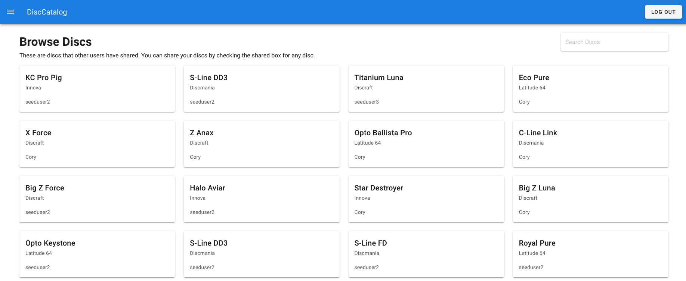
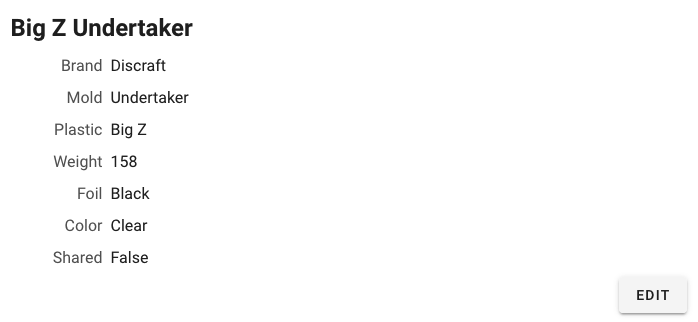
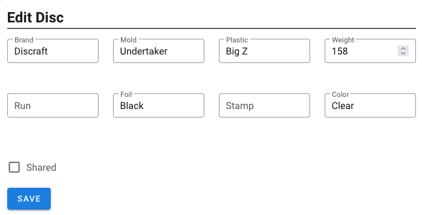

# DiscCatalog

This is a catalog for keeping track of disc golf discs virtually. 

## Features
* Browse discs you have added
* Create new discs
* Edit existing discs
* Browse public discs from other users
* Search for discs (yours or others)
* View a list of online stores collected onto one page

## Screenshots
View list of discs  
  

View disc details  
  

Edit disc  

## Technical Details
The UI is written in Vue, making use of Nuxt.js. The api is written using Express.js, making use of prisma to connect and manage the database. For authentication, rather than storing username and passwords, I am using Auth0 as an identity provider. 

## Additions
* browse pagination
* image storage for discs
* likes